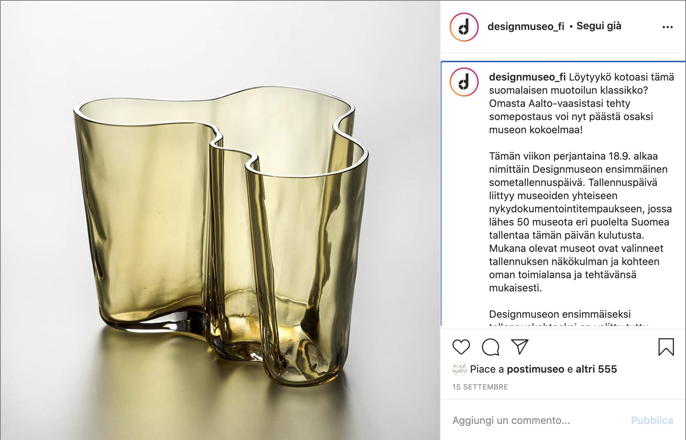
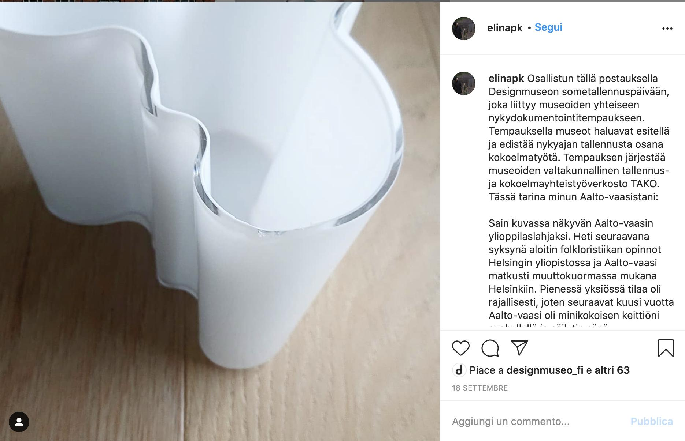

# Scenario `#sm`

### Description

Users' stories on Instagram triggered by a social media campaign of Design Museum of Helsinki

### Background

The social media managers of DMH launched an Instagram campaign to invite people to share stories about their finnish design objects, specifically their Savoy vase. The campaign was officially launched in the context of a bigger event (*sometallennuspäivä* ~ tr. recording day) occurring 18 September 2020.

### Script

The stages and the activities underlying the citizen curation activity.

**1. Preparation**

 * `Activity 1.1` The campaign was launched with a [post](https://www.instagram.com/p/CFKIGypBG7C/) (Fig.1) by DMH curators. The post includes instructions: what to post, what contents to include, which hashtag to use (`#kulutuksentallentajat`), what curators will do with users' stories.

**2. Running**

 * `Activity 2.1` *Social Media managers post exemplar posts on Instagram to encourage users to do the same.*
 * `Activity 2.2` Users publish pictures and stories of their Savoy vase, e.g. Elina's [post](https://www.instagram.com/p/CFRCOXjBBDB/) (Fig.2).

**3. Analysis**

 * `Activity 3.1` Curators *select* users' posts for being included in the museum's collection and to be shown on their Instagram profile.
 * `Activity 3.2` Developers automatically *annotate* selected posts with information about sentiment, emotion, intention, and related museum objects.

**4. Presentation**

 * `Activity 4.1` When the campaign is over, users can *explore* the posts produced by other users and can interact with those by looking at the DMH profile or the list of posts under the suggested hashtag.



*Fig. 1 Curators' launching post*

> Translation (Google translate): Can you find this classic of Finnish design in your home? A post made from your own Aalto vase can now become part of the museum's collection!
>
> This week on Friday 18.9. namely, the first day of recording of the Design Museum begins. The recording day is related to the museums' joint contemporary documentation trip, where almost 50 museums from different parts of Finland record today's consumption. The participating museums have chosen the recording perspective and destination according to their own industry and mission.
>
> The familiar Aalto vase has been chosen as the Design Museum's first recording object. You can take part in the rapture by publishing a picture of the Aalto vase in your home on your own account on Friday. In connection with the picture, say something about your item: Where it was obtained from or from whom it was obtained. Detailed instructions for participating can be found at @designmuseo_en highlights.
>
> Images published on Some during Friday will be shared in the stories of the Design Museum’s Instagram account and will be saved as a permanent part of the Design Museum’s collection. So by participating in the recording event, you will get your own somepost into the national design collection!
>
> The picture shows the Aalto vase from 1936 (Rauno Träskelin), also known as the Savoy vase designed by Alvar Aalto. You can read more about the Aalto vase in the picture on the Design Museum's website. You can find the link in the bio.
>
> With the contemporary documentation trick, museums want to present and promote contemporary recording as part of their collection work. The capture is organized by the museums' national recording and collection cooperation network TAKO.


### The user story

`#1 User's story`

 * Elina mentions that she is participating to the campaign.
 * She recalls her memory about the vase: how she got it, where it has been placed over time, what was its function over time, and where it is now. The story of the vase is a metaphor of her life.



*Fig. 2 User's story*

> Translation (Google translate): With this post, I am participating in the Design Museum's sometime recording day, which is related to the museums' joint contemporary documentation trip. Through the rapture, museums want to present and promote contemporary recording as part of their collection work. The rapture is organized by the museums' national recording and collection cooperation network TAKO. Here is the story of my Aalto vase:
>
> I received the Aalto vase shown in the picture as a student gift. The very next autumn I started studying folklore at the University of Helsinki and the Aalto vase traveled to Helsinki with a moving load. There was limited space in the small studio, so for the next six years the Aalto vase was on the open shelf of my mini-sized kitchen and I stored the coffee bag filter bags in it. I dare not even guess what Alvar Aalto would have thought. After years of study, life progressed and home squares grew address by address. Nowadays, filter bags no longer need to be stored in vases, so every spring and winter I buy tulips and put them in an Aalto vase.
>
> #kulutuksentallentajat
> #nykydokumentointi
> @designmuseo_fi
> #designmuseo
> #aaltovaasi
> #aaltomaljakko
> #savoyvaasi
> #savoymaljakko
> #alvaraalto
> #finnishdesign
> #designclassic
> @takoverkosto
> #takoverkosto

### Manifests

Reused ontologies: [PROV](http://www.w3.org/TR/prov-o/), [P-PLAN](http://purl.org/net/p-plan#), [DBPedia](http://dbpedia.org/ontology/)

Context: [context.json](https://github.com/spice-h2020/manifest/tree/main/context.json)

Complete JSON-LD example: [example](https://github.com/spice-h2020/manifest/tree/main/sm_scenario/sm_scenario.json)

#### Citizen Curation activity

A **Citizen Curation activity** is an set of activities wherein citizens interact with artefacts and people and produce citizen curation objects (to be defined). This activity is characterised by a *setting* (including *technical requirements*), a *purpose*, and a number of sequential *stages*.

```
{
  "@id": "ex:sm_1",
  "@type": "CitizenCurationActivityProvenance",
  "comment": "The Citizen Curation Activity #sm1",
  "setting":[...],
  "purpose":["Engagement","Expressing","Social interaction"],
  "stages": [...]
}
```

The setting includes information like the *type* of interaction, whether it is remote or in presence, the location.

```
"setting":{
  "interaction_type":"ex:remote",
  "context_type":"ex:social_media_campaign",
  "location":"ex:unknown"
  }
```

Each **stage** is composed by one or more *activities*, performed by one or more *agent* with a certain *role*, using a *script* as a plan. Each activity can *generate* one or more outputs.

For instance, in the preparation stage an activity performed by a curator of the museum generates a post launching the campaign.

```
{
  "@id":"ex:preparation_1_1",
  "@type": "Activity",
  "comment": "Curators launch the Social Media campaign on Instagram",
  "associated_to": {
    "@id":"ex:preparation_script_1_1",
    "@type": "Association",
    "comment":"The selection of the script used for the campaign",
    "agent":"ex:dmh_curator_1",
    "role":"ex:curator",
    "script": {
      "@id":"ex:preparation_script_1",
      "@type": "Plan",
      "comment":"The sequence of tasks, instructions, actions used for the preparation of the citizen curation activity"
    }
  },
  "used":[{
    "@id":"ex:savoy_vase",
    "@type": "Artefact"
    }],
  "generated": [{
    "@id":"ex:curator_post_1",
    "@type": "Story",
    "web_content":"https://www.instagram.com/p/CFKIGypBG7C/"
  }],
  "following":"ex:running_1"
}
```

In the running stage, both the social media managers' stories and the users' stories are generated.

```
{
  "@id":"ex:running_1",
  "@type": "Activity",
  "comment": "Users' generated stories",
  "associated_to": {
    "@id":"ex:running_script_1_1",
    "@type": "Association",
    "comment":"The selection of the script used to post on Instagram (e.g. a new post, the reply to an existing post)",
    "script": {
      "@id":"ex:running_script_1",
      "@type": "Plan",
      "comment":"The sequence of tasks performed by SM users"
    }
  },
  "generated": [{
      "@id":"ex:user_story_1",
      "@type": "Story",
      "web_content":"https://www.instagram.com/p/CFRCOXjBBDB/"
    }],
  "following":"ex:analysis_1"
}
```

In the analysis stage, curators select the user stories to be included in their collection. At the same stage, developers annotate selected stories with information about sentiment and emotion, and the matching artefact in the museum collection.

```
{
  "@id":"ex:analysis_1",
  "@type": "Activity",
  "comment": "Curators' selection of user stories",
  "associated_to": {
    "@id":"ex:analysis_script_1_1",
    "@type": "Association",
    "comment":"The selection of the script used for selecting user stories",
    "agent":"ex:dmh_curator_1",
    "role":"ex:curator",
    "script": {
      "@id":"ex:analysis_script_1",
      "@type": "Plan",
      "comment":"The sequence of tasks performed by curators"
    }
  },
  "generated": [{
    "@id":"ex:us_collection_1",
    "@type": "StoryCollection",
    "part": ["ex:user_story_1"]
  }],
  "following":"ex:analysis_2"
},
{
  "@id":"ex:analysis_2",
  "@type": "Activity",
  "comment": "Developers' annotation of selected user stories",
  "associated_to": {
    "@id":"ex:analysis_script_1_1",
    "@type": "Association",
    "comment":"The selection of the script used for annotating user stories",
    "agent":"ex:developer_1",
    "role":"ex:developer",
    "script": {
      "@id":"ex:analysis_script_2",
      "@type": "Plan",
      "input": "ex:us_collection_1"
    }
  },
  "generated": [{

  }],
  "following":"ex:presentation_1"
}
```

Lastly, curators present the selected posts on their instagram profile.

```
{
  "@id":"ex:presentation_1",
  "@type": "Activity",
  "comment": "Presentation of user stories on Instagram",
  "associated_to": {
    "@id":"ex:analysis_script_1_1",
    "@type": "Association",
    "comment":"The selection of the script used for presenting user stories",
    "agent":"ex:dmh_smm_1",
    "role":"ex:social_media_manager",
    "script": {
      "@id":"ex:presentation_script_1",
      "@type": "Plan"
    }
  },
  "generated": [{
    "@id":"ex:us_published_collection_1",
    "@type": "StoryCollection",
    "part": ["ex:user_story_1"]
  }]
}
```

#### Scripts

Every activity performed in a stage is associated to a script (`prov:Plan`), which can be defined separately.

For instance, the preparation stage (which is not explicitly described) has one activity `ex:preparation_1_1`, representing the launch of the social media campaign. This activity is associated to a responsible agent, having a role and a script `ex:preparation_script_1` (more agents with different roles and scripts can be associated to the same activity).

```
"@id":"ex:preparation_1_1",
"@type": "Activity",
"associated_to": {
  "@id":"ex:preparation_script_1_1",
  "@type": "Association",
  "agent":"ex:dmh_curator_1",
  "role":"ex:curator",
  "script": "ex:preparation_script_1"
}
```

A script can be represented as a sequence of general steps, having input and output values. For instance, the script `ex:preparation_script_1` can be represented as follows:

```
{
  "@id":"ex:preparation_script_1",
  "@type": "Plan",
  "comment":"The sequence of tasks, instructions, actions used for the preparation of the citizen curation activity",
  "has_step": [{
    "@id": "ex:artefact_selection",
    "@type":"Step",
    "input": ["Artefact","Collection"]
    "output": ["Artefact","Collection"]
  },
  {
    "@id": "ex:post_publication",
    "@type":"Step",
    "input": ["Image","Text"]
    "output": ["Story"]
  }]
}
```

Questions

 * What is the best way to represent inputs and output values? Classes or individuals?
 * Should a script reference the general concepts (classes or individuals) or the specific inputs/outputs? e.g. "Artefact" or "ex:savoy_vase".
 * do we need activity status?
 * where to include developers' annotations?

TODO

 * add social media managers' posts
 * add generated annotations of developers
 * add time of activities

When the scenario it's easy, we can use shortcuts like the following:

```
"@id":"ex:preparation_1_1",
"has_step": [...],
"used": [{
  "@id":"ex:savoy_vase",
  "@type": "Artefact"
  }],
"generated": [{
  "@id":"ex:curator_post_1",
  "@type": "Story",
  "web_content":"https://www.instagram.com/p/CFKIGypBG7C/"
}]
```

#### User stories

In the running stage, one or more citizen curation objects are realized.

```
"generated": [{
    "@id":"ex:user_story_1",
    "@type": "Story",
    "web_content":"https://www.instagram.com/p/CFRCOXjBBDB/",
    "agent": "ex:user_1",
    "part": [
      {
        "@id":"ex:text_1",
        "@value":"Osallistun tällä postauksella Designmuseon sometallennuspäivään, joka liittyy museoiden yhteiseen nykydokumentointitempaukseen…"
      },
      {
        "@id":"ex:img_1",
        "web_content":"https://scontent-mxp1-1.cdninstagram.com/v/t51.2885-15/e35/118959543_3548968821813785_1524019357282270116_n.jpg?_nc_ht=scontent-mxp1-1.cdninstagram.com&_nc_cat=105&_nc_ohc=RLzqx_iQQBQAX-w2gtx&tp=1&oh=cb4013bddf240428802337c1b4b096f8&oe=5FFF75E9"
      }
    ]
}]
```
Questions:

 * part/whole relation (CCO and museum object) - since the object recognition it something that is associated in the "analysis stage", should it be represented here? Same applies to the narrative structure.


TODO:

 * Represent Size, weight, etc
 * Represent Story/narrative about artifact
 * generated comments by other users
